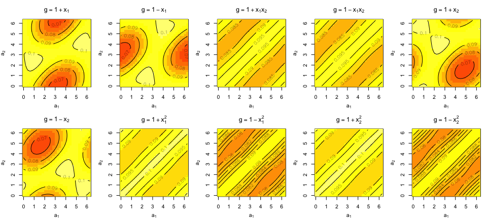
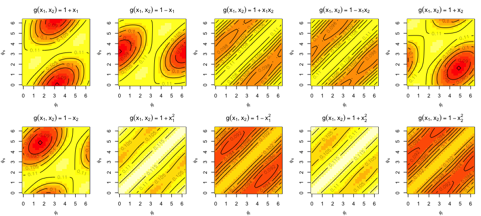
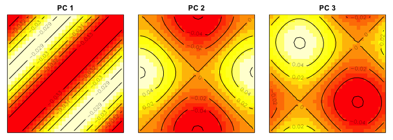
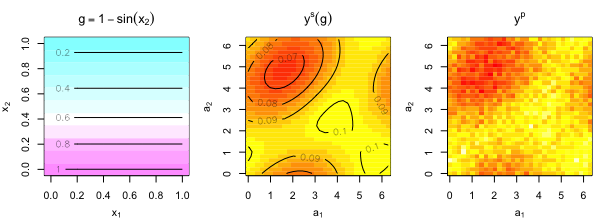
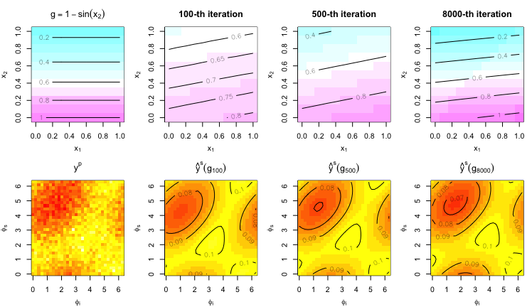
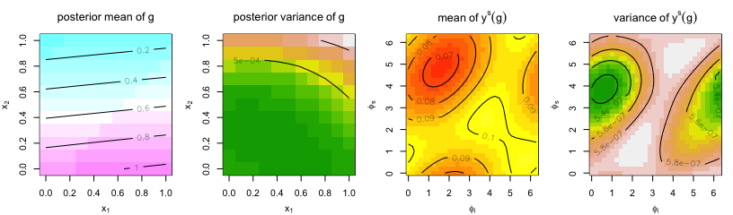
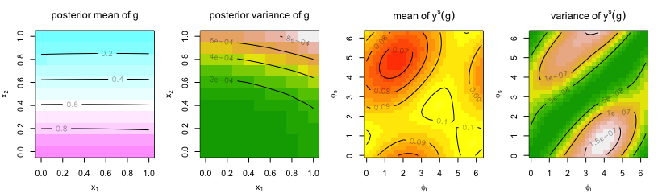
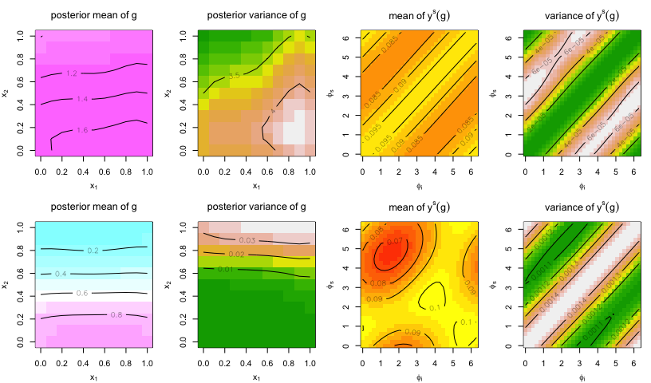

Functional-Input Gaussian Processes with Applications to Inverse
Scattering Problems (Reproducibility)
================

This instruction aims to reproduce the results in the paper “*Advancing
Inverse Scattering with Surrogate Modeling and Bayesian Inference for
Functional Inputs*”. Hereafter, functional-Input Gaussian Process is
abbreviated by *FIGP*.

The following results are reproduced in this file

- The FEM simulation and Born approximation: Figures 2 and 3
- The inverse results with FEM simulator in Section 4.1 (Figures 4, 5,
  6, 7, and 9, and Tables 1 and 2)
- The inverse results with multi-fidelity emulator in Section 4.2 by
  incorporating FEM simulator and Born approximation (Figure 8 and Table
  3)

##### Step 0.1: load functions and packages

``` r
library(randtoolbox)
library(R.matlab)
library(cubature)
library(plgp)
library(pracma)
source("FIGP.R")                # FIGP 
source("matern.kernel.R")       # matern kernel computation
source("FIGP.kernel.R")         # kernels for FIGP
source("loocv.R")               # LOOCV for FIGP
source("likelihood.R")          # likelihood function
source("ys_emulators.R")        # FIGP surrogate model
source("BayesInverse_FIGP.R")   # proposed Bayesian approach
source("FIGP.kernel.discrete.R")# kernel function approximation
source("KL.expan.R")            # KL expansion for comparison
source("GP.R")                  # conventional GP
source("BayesInverse_KL.R")     # Bayesian approach by KL expansion for comparison
eps <- sqrt(.Machine$double.eps) #small nugget for numeric stability
score <- function(x, mu, s2){   # computing predictive scores to examine the performance
  -(x-mu)^2/s2-log(s2)
}
```

## Reproducing Figures 2 and 3

Demonstrate the training FEM simulations and Born approximations. The
data are saved in the `/Data` folder. Since the data were generated
through Matlab, we use the function `readMat` in the package `R.matlab`
to read the data. There were ten training data points, where the
functional inputs are

- $g(x_1,x_2)=1+x_1$
- $g(x_1,x_2)=1-x_1$
- $g(x_1,x_2)=1+x_1x_2$
- $g(x_1,x_2)=1-x_1x_2$
- $g(x_1,x_2)=1+x_2$
- $g(x_1,x_2)=1-x_2$
- $g(x_1,x_2)=1+x_1^2$
- $g(x_1,x_2)=1-x_1^2$
- $g(x_1,x_2)=1+x_2^2$
- $g(x_1,x_2)=1-x_2^2$

##### Reproducing Figure 2

``` r
func.title <- c(expression(g(x[1],x[2])==1+x[1]), 
                expression(g(x[1],x[2])==1-x[1]),
                expression(g(x[1],x[2])==1+x[1]*x[2]),
                expression(g(x[1],x[2])==1-x[1]*x[2]),
                expression(g(x[1],x[2])==1+x[2]),
                expression(g(x[1],x[2])==1-x[2]),
                expression(g(x[1],x[2])==1+x[1]^2),
                expression(g(x[1],x[2])==1-x[1]^2),
                expression(g(x[1],x[2])==1+x[2]^2),
                expression(g(x[1],x[2])==1-x[2]^2))    

# Finite-element simulations
Ys <- matrix(0,nrow=10,ncol=32*32)
par(mfrow=c(2,5))
par(mgp=c(2.5,1,0))
par(mar = c(3.5, 3.5, 3, 1))
for(i in 1:10){
  g.out <- readMat(paste0("DATA/q_func",i,".mat"))$Ffem
  image(seq(0,2*pi,length.out=32), seq(0,2*pi,length.out=32),
        Re(g.out), zlim=c(0.05,0.11),
        xlab=expression(phi[i]), ylab=expression(phi[s]), 
        col=heat.colors(12, rev = FALSE),
        main=func.title[i])
  contour(seq(0,2*pi,length.out=32), seq(0,2*pi,length.out=32),
          Re(g.out), add = TRUE, nlevels = 5)
  Ys[i,] <- c(Re(g.out))
}
```



##### Reproducing Figure 3

``` r
# Born approximation
Yb <- matrix(0,nrow=10,ncol=32*32)
par(mfrow=c(2,5))
par(mgp=c(2.5,1,0))
par(mar = c(3.5, 3.5, 3, 1))
for(i in 1:10){
  g.out <- readMat(paste0("DATA/q_func",i,".mat"))$Fborn
  image(seq(0,2*pi,length.out=32), seq(0,2*pi,length.out=32),
        Re(g.out), zlim=c(0.08,0.12),
        xlab=expression(phi[i]), ylab=expression(phi[s]), 
        col=heat.colors(12, rev = FALSE),
        main=func.title[i])
  contour(seq(0,2*pi,length.out=32), seq(0,2*pi,length.out=32),
          Re(g.out), add = TRUE, nlevels = 5)
  Yb[i,] <- c(Re(g.out))
}
```



## Reproducing Section 4.1

We first apply the approach to the inverse scattering problem with only
one simulator by finite-element methods (FEMs).

##### Reproducing Figure 4

Apply PCA to reduce the dimension of the image output. We choose the
number of PCs that explains more than 99.99% of the variations, which is
3 in this case. Plot the three PCs, which reproduces Figure 4.

``` r
# PCA to reduce output dimension
pca.out <- prcomp(Ys, scale = FALSE, center = FALSE)
n.comp <- which(summary(pca.out)$importance[3,] > 0.9999)[1]
print(n.comp)
```

    ## PC3 
    ##   3

``` r
U <- pca.out$rotation[,1:n.comp] # eigenvectors

par(mfrow=c(1,3))
par(mar = c(1, 1, 2, 1))
for(i in 1:n.comp){
  eigen.vec <- matrix(c(pca.out$rotation[,i]), 32, 32)
  image(eigen.vec,yaxt="n",xaxt="n",
        col=heat.colors(12, rev = FALSE),
        main=paste("PC",i))
  contour(eigen.vec, add = TRUE, nlevels = 5)
}
```



##### Reproducing Table 1

Fit a FIGP model based on the 10 training simulations by FEMs. The
resulting table shows the leave-one-out cross-validation (LOOCV) by
using a linear and non-linear kernel function.

``` r
# training functional inputs (G)
G <- list(function(x) 1+x[1],
          function(x) 1-x[1],
          function(x) 1+x[1]*x[2],
          function(x) 1-x[1]*x[2],
          function(x) 1+x[2],
          function(x) 1-x[2],
          function(x) 1+x[1]^2,
          function(x) 1-x[1]^2,
          function(x) 1+x[2]^2,
          function(x) 1-x[2]^2)
n <- length(G)

gp.fit <- gpnl.fit <- vector("list",n.comp)
for(i in 1:n.comp){
  y <- Ys %*% U[,i]
  # fit FIGP with a linear kernel  
  gp.fit[[i]] <- FIGP(G, d=2, y, nu=2.5, nug=eps, kernel = "linear")
  # fit FIGP with a nonlinear kernel    
  gpnl.fit[[i]] <- FIGP(G, d=2, y, nu=2.5, nug=eps, kernel = "nonlinear")
}

# computing LOOCVs
loocv.linear <- sapply(gp.fit, loocv)
loocv.nonlinear <- sapply(gpnl.fit, loocv)

out <- rbind(format(loocv.linear,digits=4), format(loocv.nonlinear,digits=4))
colnames(out) <- c("f1", "f2", "f3")
rownames(out) <- c("linear", "nonlinear")
knitr::kable(out)
```

|           | f1        | f2        | f3        |
|:----------|:----------|:----------|:----------|
| linear    | 7.491e-05 | 3.461e-17 | 2.377e-17 |
| nonlinear | 8.140e-05 | 2.220e-06 | 1.966e-06 |

##### Reproducing Figure 5

Figure 5 shows the true input $g(x_1,x_2)=1-\sin(x_2)$ and the true
output of $y^p$ and $y^s(g)$.

``` r
# choose the fitted FIGP model with a linear kernel
fem.figp <- gp.fit

# test functional inputs (gnew) and output 
gnew <- list(function(x) 1-sin(x[2]))
ys.true <- c(Re(readMat(paste0("DATA/q_sine.mat"))$Ffem))
m <- length(ys.true)

# Simulate yp
set.seed(1)      #set a random seed for reproducing
s2 <- 0.005^2    # yp variance
yp <- ys.true + rnorm(m, 0, sd=sqrt(s2))

# set up 
X.grid <- expand.grid(seq(0,1,0.1),seq(0,1,0.1)) # GP test locations (for visualization of inverse g)
XN <- randtoolbox::sobol(100, 2) # for gN realizqtions
n.grid <- nrow(X.grid)
g.true <- gnew[[1]](X.grid)[,1]

par(mfrow=c(1,3))
par(mgp=c(2.5,1,0))
par(mar = c(3.5, 3.5, 3, 1))
image(seq(0,1,length.out=sqrt(n.grid)), seq(0,1,length.out=sqrt(n.grid)),
      matrix(g.true, sqrt(n.grid),sqrt(n.grid)), 
      zlim=c(0,1.2),col=cm.colors(15, rev = FALSE), 
      xlab=expression(x[1]), ylab=expression(x[2]),
      main=expression(g==1-sin(x[2])))
contour(matrix(g.true,sqrt(n.grid),sqrt(n.grid)), add = TRUE, nlevels = 4)

image(seq(0,2*pi,length.out=32), seq(0,2*pi,length.out=32),
      matrix(ys.true,32,32), 
      xlab=expression(phi[i]), ylab=expression(phi[s]), 
      col=heat.colors(15, rev = FALSE), 
      zlim=c(0.05,0.115), main=expression({y^s}(g)))
contour(seq(0,2*pi,length.out=32), seq(0,2*pi,length.out=32), matrix(ys.true,32,32), add = TRUE, nlevels = 4)

image(seq(0,2*pi,length.out=32), seq(0,2*pi,length.out=32),
      matrix(yp,32,32), 
      xlab=expression(phi[i]), ylab=expression(phi[s]), 
      col=heat.colors(15, rev = FALSE), 
      zlim=c(0.05,0.115), main=expression({y^p}))
```



##### Reproducing Figure 6

Figure 6 demonstrates the sampling results in the 100-th, 500-th, and
8000-th iterations of the MCMC algorithm.

``` r
# posterior of inverse g and ys: single fidelity
post.single <- BayesInverse_FIGP(XN, X.grid, yp, U, 
                              nu=2.5, nug=sqrt(.Machine$double.eps),
                              figp.1=fem.figp, figp.2=NULL, fidelity=c("single","multi")[1],
                              plot.fg = FALSE, seed = 11, trace=FALSE)

par(mfrow=c(2,4))
par(mgp=c(2.5,1,0))
par(mar = c(3.5, 3.5, 3, 1))
image(seq(0,1,length.out=sqrt(n.grid)), seq(0,1,length.out=sqrt(n.grid)),
      matrix(g.true, sqrt(n.grid),sqrt(n.grid)), 
      xlab=expression(x[1]), ylab=expression(x[2]),
      zlim=c(0,1.2), col=cm.colors(15, rev = FALSE), 
      main=expression(g==1-sin(x[2])))
contour(seq(0,1,length.out=sqrt(n.grid)), seq(0,1,length.out=sqrt(n.grid)),matrix(g.true,sqrt(n.grid),sqrt(n.grid)), add = TRUE, nlevels = 4)

for(i in c(100,500,8000)){
  image(seq(0,1,length.out=sqrt(n.grid)), seq(0,1,length.out=sqrt(n.grid)),
        matrix(post.single$g.sample[,i],sqrt(n.grid),sqrt(n.grid)), 
        xlab=expression(x[1]), ylab=expression(x[2]),
        zlim=c(0,1.2),col=cm.colors(15, rev = FALSE), 
        main=paste0(i,"-th iteration"))
  contour(matrix(post.single$g.sample[,i],sqrt(n.grid),sqrt(n.grid)), add = TRUE, nlevels = 4)
}

image(seq(0,2*pi,length.out=32), seq(0,2*pi,length.out=32),
      matrix(yp,32,32), 
      xlab=expression(phi[i]), ylab=expression(phi[s]), 
      col=heat.colors(15, rev = FALSE), 
      zlim=c(0.05,0.115), main=expression({y^p}))

for(i in c(100,500,8000)){
  image(seq(0,2*pi,length.out=32), seq(0,2*pi,length.out=32),
        matrix(post.single$yhat[,i],32,32), 
        xlab=expression(phi[i]), ylab=expression(phi[s]), 
        col=heat.colors(15, rev = FALSE), 
        zlim=c(0.05,0.115), main=bquote({hat(y)^s}(g[.(i)])))
  contour(seq(0,2*pi,length.out=32), seq(0,2*pi,length.out=32), matrix(post.single$yhat[,i],32,32), add = TRUE, nlevels = 4)
}
```



##### Reproducing Figure 7

Figure 7 shows the inverse results based on the FEM simulator.

``` r
# compute mean and variance
g.single.mean <- apply(post.single$g.sample[,seq(5001,10000,2)],1,mean)
g.single.var <- apply(post.single$g.sample[,seq(5001,10000,2)],1,var)
ys.single.mean <- apply(post.single$yhat[,seq(5001,10000,2)],1,mean)
ys.single.var <- apply(post.single$yhat[,seq(5001,10000,2)],1,var)

par(mfrow=c(1,4))
par(mgp=c(2.5,1,0))
par(mar = c(3.5, 3.5, 3, 1))
image(seq(0,1,length.out=sqrt(n.grid)), seq(0,1,length.out=sqrt(n.grid)),
      matrix(g.single.mean,sqrt(n.grid),sqrt(n.grid)), 
      xlab=expression(x[1]), ylab=expression(x[2]),
      zlim=c(0,1.2),col=cm.colors(15, rev = FALSE), 
      main=expression(posterior~mean~of~g))
contour(seq(0,1,length.out=sqrt(n.grid)), seq(0,1,length.out=sqrt(n.grid)),matrix(g.single.mean,sqrt(n.grid),sqrt(n.grid)), add = TRUE, nlevels = 4)

image(seq(0,1,length.out=sqrt(n.grid)), seq(0,1,length.out=sqrt(n.grid)),
      matrix(g.single.var,sqrt(n.grid),sqrt(n.grid)), 
      col=terrain.colors(15, rev = FALSE), 
      xlab=expression(x[1]), ylab=expression(x[2]),
      main=expression(posterior~variance~of~g))
contour(seq(0,1,length.out=sqrt(n.grid)), seq(0,1,length.out=sqrt(n.grid)), matrix(g.single.var,sqrt(n.grid),sqrt(n.grid)), add = TRUE, nlevels = 4)

image(seq(0,2*pi,length.out=32), seq(0,2*pi,length.out=32),
      matrix(ys.single.mean,32,32), 
      col=heat.colors(15, rev = FALSE), 
      zlim=c(0.05,0.115), 
      xlab=expression(phi[i]), ylab=expression(phi[s]), 
      main=expression(mean~of~{y^s}(g)))
contour(seq(0,2*pi,length.out=32), seq(0,2*pi,length.out=32),matrix(ys.single.mean,32,32), add = TRUE, nlevels = 4)

image(seq(0,2*pi,length.out=32), seq(0,2*pi,length.out=32),
      matrix(ys.single.var,32,32), 
      col=terrain.colors(15, rev = FALSE), 
      xlab=expression(phi[i]), ylab=expression(phi[s]), 
      main=expression(variance~of~{y^s}(g)))
contour(seq(0,2*pi,length.out=32), seq(0,2*pi,length.out=32), matrix(ys.single.var,32,32), add = TRUE, nlevels = 4)
```



## Reproducing Section 4.2

We first apply the approach to the inverse scattering problem with
multi-fidelity simulators (FEMs and Born approximation).

##### Reproducing Table 3

Fit a multi-fidelity FIGP model based on the 10 training simulations by
FEMs and Born approximation. The resulting table shows the leave-one-out
cross-validation (LOOCV) by using a linear and non-linear kernel
function.

``` r
# fit FIGP for born and diff
born.gp.fit <- born.gpnl.fit <- diff.gp.fit <- diff.gpnl.fit <- vector("list",n.comp)
for(i in 1:n.comp){
  yb <- Yb %*% U[,i]
  # fit FIGP with a linear kernel  
  born.gp.fit[[i]] <- FIGP(G, d=2, yb, nu=2.5, nug=eps, kernel = "linear")
  # fit FIGP with a nonlinear kernel  
  born.gpnl.fit[[i]] <- FIGP(G, d=2, yb, nu=2.5, nug=eps, kernel = "nonlinear")
  
  ys <- Ys %*% U[,i]
  # fit FIGP with a linear kernel  
  diff.gp.fit[[i]] <- MF.FIGP(G, d=2, ys, yb, nu=2.5, nug=eps, kernel = "linear")
  # fit FIGP with a nonlinear kernel  
  diff.gpnl.fit[[i]] <- MF.FIGP(G, d=2, ys, yb, nu=2.5, nug=eps, kernel = "nonlinear")
}

# computing LOOCVs
born.loocv.linear <- sapply(born.gp.fit, loocv)
born.loocv.nonlinear <- sapply(born.gpnl.fit, loocv)

diff.loocv.linear <- sapply(diff.gp.fit, loocv)
diff.loocv.nonlinear <- sapply(diff.gpnl.fit, loocv)

out1 <- rbind(format(born.loocv.linear,digits=4), format(born.loocv.nonlinear,digits=4))
out2 <- rbind(format(diff.loocv.linear,digits=4), format(diff.loocv.nonlinear,digits=4))
out <- cbind(out1,out2)
colnames(out) <- c("h1", "h2", "h3", "d1", "d2", "d3")
rownames(out) <- c("linear", "nonlinear")
knitr::kable(out)
```

|           | h1        | h2        | h3        | d1        | d2        | d3        |
|:----------|:----------|:----------|:----------|:----------|:----------|:----------|
| linear    | 2.001e-17 | 1.434e-17 | 1.285e-17 | 7.491e-05 | 7.603e-18 | 9.467e-20 |
| nonlinear | 6.630e-07 | 1.209e-06 | 1.071e-06 | 6.795e-05 | 7.291e-18 | 8.893e-20 |

##### Reproducing Figure 9

Figure 9 shows the inverse results based on the multi-fidelity
simulators (FEMs and Born approximation).

``` r
# choose the fitted FIGPs with lower LOOCVs
born.figp <- born.gp.fit
diff.figp <- diff.gpnl.fit

# print estimated rho
rho.hat <- sapply(diff.figp, function(x) x$rho)
print(rho.hat)
```

    ## [1] 0.6203948 1.3548569 1.3548569

``` r
# posterior of inverse g and ys: multifidelity
post.multi <- BayesInverse_FIGP(XN, X.grid, yp, U, 
                                nu=2.5, nug=sqrt(.Machine$double.eps),
                                figp.1=born.figp, figp.2=diff.gp.fit, fidelity=c("single","multi")[2],
                                plot.fg = FALSE, seed = 4, trace=FALSE)

# compute mean and variance
g.multi.mean <- apply(post.multi$g.sample[,seq(5001,10000,2)],1,mean)
g.multi.var <- apply(post.multi$g.sample[,seq(5001,10000,2)],1,var)
ys.multi.mean <- apply(post.multi$yhat[,seq(5001,10000,2)],1,mean)
ys.multi.var <- apply(post.multi$yhat[,seq(5001,10000,2)],1,var)

par(mfrow=c(1,4))
par(mgp=c(2.5,1,0))
par(mar = c(3.5, 3.5, 3, 1))
image(seq(0,1,length.out=sqrt(n.grid)), seq(0,1,length.out=sqrt(n.grid)),
      matrix(g.multi.mean,sqrt(n.grid),sqrt(n.grid)), 
      zlim=c(0,1.2),col=cm.colors(15, rev = FALSE), 
      xlab=expression(x[1]), ylab=expression(x[2]), main=expression(posterior~mean~of~g))
contour(seq(0,1,length.out=sqrt(n.grid)), seq(0,1,length.out=sqrt(n.grid)),
        matrix(g.multi.mean,sqrt(n.grid),sqrt(n.grid)), add = TRUE, nlevels = 4)

image(seq(0,1,length.out=sqrt(n.grid)), seq(0,1,length.out=sqrt(n.grid)),
      matrix(g.multi.var,sqrt(n.grid),sqrt(n.grid)), 
      col=terrain.colors(15, rev = FALSE), 
      xlab=expression(x[1]), ylab=expression(x[2]), main=expression(posterior~variance~of~g))
contour(seq(0,1,length.out=sqrt(n.grid)), seq(0,1,length.out=sqrt(n.grid)),
        matrix(g.multi.var,sqrt(n.grid),sqrt(n.grid)), add = TRUE, nlevels = 4)

image(seq(0,2*pi,length.out=32), seq(0,2*pi,length.out=32),
      matrix(ys.multi.mean,32,32), 
      col=heat.colors(15, rev = FALSE), 
      zlim=c(0.05,0.115), 
      xlab=expression(phi[i]), ylab=expression(phi[s]), main=expression(mean~of~{y^s}(g)))
contour(seq(0,2*pi,length.out=32), seq(0,2*pi,length.out=32),
        matrix(ys.multi.mean,32,32), add = TRUE, nlevels = 4)

image(seq(0,2*pi,length.out=32), seq(0,2*pi,length.out=32),
      matrix(ys.multi.var,32,32), 
      col=terrain.colors(15, rev = FALSE), 
      xlab=expression(phi[i]), ylab=expression(phi[s]), main=expression(variance~of~{y^s}(g)))
contour(seq(0,2*pi,length.out=32), seq(0,2*pi,length.out=32),
        matrix(ys.multi.var,32,32), add = TRUE, nlevels = 4)
```



##### Reproducing Table 2 and Figure 8

Compare the results with KL basis expansion methods.

``` r
# FIGP + KLGP
post.KL <- BayesInverse_KL(klgp=NULL, X.grid, X.grid, yp, U, fraction=0.95, emulator="figp", figp=fem.figp,
                           nu=2.5, nug=sqrt(.Machine$double.eps),
                           plot.fg = FALSE, seed = 3, trace=FALSE)

# compute mean and variance
g.KL.mean <- apply(post.KL$g.sample[,seq(5001,10000,2)],1,mean)
g.KL.var <- apply(post.KL$g.sample[,seq(5001,10000,2)],1,var)
ys.KL.mean <- apply(post.KL$yhat[,seq(5001,10000,2)],1,mean)
ys.KL.var <- apply(post.KL$yhat[,seq(5001,10000,2)],1,var)

# KLGP + KLGP
klgp <- KLGP.fit(d=2, Ys=Ys, G=G, U=U, fraction=0.95, XN=X.grid)
post.KLKL <- BayesInverse_KL(klgp, X.grid, X.grid, yp, U, fraction=0.95, emulator="klgp", figp=NULL,
                           nu=2.5, nug=sqrt(.Machine$double.eps),
                           plot.fg = FALSE, seed = 3, trace=FALSE)

# compute mean and variance
g.KLKL.mean <- apply(post.KLKL$g.sample[,seq(5001,10000,2)],1,mean)
g.KLKL.var <- apply(post.KLKL$g.sample[,seq(5001,10000,2)],1,var)
ys.KLKL.mean <- apply(post.KLKL$yhat[,seq(5001,10000,2)],1,mean)
ys.KLKL.var <- apply(post.KLKL$yhat[,seq(5001,10000,2)],1,var)

out1 <- c(sqrt(mean((g.single.mean - g.true)^2)), 
          sqrt(mean((g.KL.mean - g.true)^2)),
          sqrt(mean((g.KLKL.mean - g.true)^2)),
          sqrt(mean((g.multi.mean - g.true)^2)))
out2 <- c(mean(score(g.true, g.single.mean, g.single.var)), 
          mean(score(g.true, g.KL.mean, g.KL.var)),
          mean(score(g.true, g.KLKL.mean, g.KLKL.var)),
          mean(score(g.true, g.multi.mean, g.multi.var)))
out3 <- c(sqrt(mean((ys.single.mean - ys.true)^2)),
          sqrt(mean((ys.KL.mean - ys.true)^2)),
          sqrt(mean((ys.KLKL.mean - ys.true)^2)),
          sqrt(mean((ys.multi.mean - ys.true)^2)))
out4 <- c(mean(score(ys.true, ys.single.mean, ys.single.var)),
          mean(score(ys.true, ys.KL.mean, ys.KL.var)),
          mean(score(ys.true, ys.KLKL.mean, ys.KLKL.var)),
          mean(score(ys.true, ys.multi.mean, ys.multi.var)))
out <- cbind(out1,out2,out3,out4)
colnames(out) <- c("g.rmse", "g.score", "ys.rmse", "ys.score")
rownames(out) <- c("FEM", "KL", "KLKL", "FEM+Born")
knitr::kable(out)
```

|          |    g.rmse |   g.score |   ys.rmse |  ys.score |
|:---------|----------:|----------:|----------:|----------:|
| FEM      | 0.0347668 |  3.812578 | 0.0004908 | 13.967225 |
| KL       | 0.0535973 |  4.435537 | 0.0005706 |  6.667206 |
| KLKL     | 0.8147277 | -1.492975 | 0.0085722 |  8.726921 |
| FEM+Born | 0.0367120 |  6.094397 | 0.0002265 | 15.978453 |

``` r
par(mfrow=c(2,4))
par(mgp=c(2.5,1,0))
par(mar = c(3.5, 3.5, 3, 1))
g.KLKL.truncate <- g.KLKL.mean # for visualization
g.KLKL.truncate[g.KLKL.truncate > 1.2] <- 1.2
image(seq(0,1,length.out=sqrt(n.grid)), seq(0,1,length.out=sqrt(n.grid)),
      matrix(g.KLKL.truncate,sqrt(n.grid),sqrt(n.grid)),
      zlim=c(0,1.2),col=cm.colors(15, rev = FALSE),
      xlab=expression(x[1]), ylab=expression(x[2]), main=expression(posterior~mean~of~g))
contour(seq(0,1,length.out=sqrt(n.grid)), seq(0,1,length.out=sqrt(n.grid)),
        matrix(g.KLKL.mean,sqrt(n.grid),sqrt(n.grid)), add = TRUE, nlevels = 4)

image(seq(0,1,length.out=sqrt(n.grid)), seq(0,1,length.out=sqrt(n.grid)),
      matrix(g.KLKL.var,sqrt(n.grid),sqrt(n.grid)),
      col=terrain.colors(15, rev = FALSE),
      xlab=expression(x[1]), ylab=expression(x[2]), main=expression(posterior~variance~of~g))
contour(seq(0,1,length.out=sqrt(n.grid)), seq(0,1,length.out=sqrt(n.grid)),
        matrix(g.KLKL.var,sqrt(n.grid),sqrt(n.grid)), add = TRUE, nlevels = 4)

image(seq(0,2*pi,length.out=32), seq(0,2*pi,length.out=32),
      matrix(ys.KLKL.mean,32,32),
      col=heat.colors(15, rev = FALSE),
      zlim=c(0.05,0.115), 
      xlab=expression(phi[i]), ylab=expression(phi[s]), main=expression(mean~of~{y^s}(g)))
contour(seq(0,2*pi,length.out=32), seq(0,2*pi,length.out=32),
        matrix(ys.KLKL.mean,32,32), add = TRUE, nlevels = 4)

image(seq(0,2*pi,length.out=32), seq(0,2*pi,length.out=32),
      matrix(ys.KLKL.var,32,32),
      col=terrain.colors(15, rev = FALSE),
      xlab=expression(phi[i]), ylab=expression(phi[s]), main=expression(variance~of~{y^s}(g)))
contour(seq(0,2*pi,length.out=32), seq(0,2*pi,length.out=32),
        matrix(ys.KLKL.var,32,32), add = TRUE, nlevels = 4)

image(seq(0,1,length.out=sqrt(n.grid)), seq(0,1,length.out=sqrt(n.grid)),
      matrix(g.KL.mean,sqrt(n.grid),sqrt(n.grid)),
      zlim=c(0,1.2),col=cm.colors(15, rev = FALSE),
      xlab=expression(x[1]), ylab=expression(x[2]), main=expression(posterior~mean~of~g))
contour(seq(0,1,length.out=sqrt(n.grid)), seq(0,1,length.out=sqrt(n.grid)),
        matrix(g.KL.mean,sqrt(n.grid),sqrt(n.grid)), add = TRUE, nlevels = 4)

image(seq(0,1,length.out=sqrt(n.grid)), seq(0,1,length.out=sqrt(n.grid)),
      matrix(g.KL.var,sqrt(n.grid),sqrt(n.grid)),
      col=terrain.colors(15, rev = FALSE),
      xlab=expression(x[1]), ylab=expression(x[2]), main=expression(posterior~variance~of~g))
contour(seq(0,1,length.out=sqrt(n.grid)), seq(0,1,length.out=sqrt(n.grid)),
        matrix(g.KL.var,sqrt(n.grid),sqrt(n.grid)), add = TRUE, nlevels = 4)

image(seq(0,2*pi,length.out=32), seq(0,2*pi,length.out=32),
      matrix(ys.KL.mean,32,32),
      col=heat.colors(15, rev = FALSE),
      zlim=c(0.05,0.115), xlab=expression(phi[i]), ylab=expression(phi[s]), main=expression(mean~of~{y^s}(g)))
contour(seq(0,2*pi,length.out=32), seq(0,2*pi,length.out=32),
        matrix(ys.KL.mean,32,32), add = TRUE, nlevels = 4)

image(seq(0,2*pi,length.out=32), seq(0,2*pi,length.out=32),
      matrix(ys.KL.var,32,32),
      col=terrain.colors(15, rev = FALSE),
      xlab=expression(phi[i]), ylab=expression(phi[s]), main=expression(variance~of~{y^s}(g)))
contour(seq(0,2*pi,length.out=32), seq(0,2*pi,length.out=32),
        matrix(ys.KL.var,32,32), add = TRUE, nlevels = 4)
```


