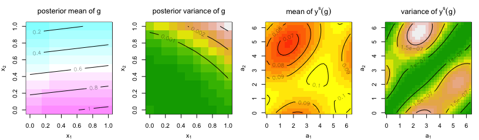

Advancing Inverse Scattering with Surrogate Modeling and Bayesian
Inference for Functional Inputs (Reproducibility)
================
Chih-Li Sung
January 07, 2024

This instruction aims to reproduce the results in the paper “Advancing
Inverse Scattering with Surrogate Modeling and Bayesian Inference for
Functional Inputs”.

The following results are reproduced in this file

- The FEM simulation and Born approximation: Figures 2 and 3
- The inverse results with FEM simulator in Section 5.1 (Figures 5, 6,
  7, and 8, and Tables 1 and 2)
- The inverse results with multi-fidelity emulator in Section 5.2 by
  incorporating FEM simulator and Born approximation (Figure 9 and Table
  3)

The code to reproduce the results for the numerical study in Section 4.3
(Figure 4) is provided separately and will be briefly described at the
end of this instruction.

##### Step 0.1: load functions and packages

``` r
library(parallel)
library(randtoolbox)
library(plgp)
library(R.matlab)
library(pracma)
source("FIGP.R")                # FIGP 
source("matern.kernel.R")       # matern kernel computation
source("FIGP.kernel.R")         # kernels for FIGP
source("loocv.R")               # LOOCV for FIGP
source("likelihood.R")          # likelihood function
source("ys_emulators.R")        # FIGP surrogate model
source("BayesInverse_FIGP.R")   # proposed Bayesian approach
source("FIGP.kernel.discrete.R")# kernel function approximation
source("KL.expan.R")            # KL expansion for comparison
source("GP.R")                  # conventional GP
source("BayesInverse_KL.R")     # Bayesian approach by KL expansion for comparison
# nugget for numerical stability
eps <- 1e-6

# computing predictive scores; the higher the better 
score <- function(x, mu, s2){   
  -(x-mu)^2/s2-log(s2)
}

# number of chain for MCMC
nchain <- 5
```

## Reproducing Figures 2 and 3

Demonstrate the training FEM simulations and Born approximations. The
data are saved in the `/Data` folder. Since the data were generated
through Matlab, we use the function `readMat` in the package `R.matlab`
to read the data. There were ten training data points, where the
functional inputs are

- $g(x_1,x_2)=1+x_1$
- $g(x_1,x_2)=1-x_1$
- $g(x_1,x_2)=1+x_1x_2$
- $g(x_1,x_2)=1-x_1x_2$
- $g(x_1,x_2)=1+x_2$
- $g(x_1,x_2)=1-x_2$
- $g(x_1,x_2)=1+x_1^2$
- $g(x_1,x_2)=1-x_1^2$
- $g(x_1,x_2)=1+x_2^2$
- $g(x_1,x_2)=1-x_2^2$

##### Reproducing Figure 2

``` r
func.title <- c(expression(g==1+x[1]), 
                expression(g==1-x[1]),
                expression(g==1+x[1]*x[2]),
                expression(g==1-x[1]*x[2]),
                expression(g==1+x[2]),
                expression(g==1-x[2]),
                expression(g==1+x[1]^2),
                expression(g==1-x[1]^2),
                expression(g==1+x[2]^2),
                expression(g==1-x[2]^2))    

# Finite-element simulations
Ys <- matrix(0,nrow=10,ncol=32*32)
par(mfrow=c(2,5))
par(mgp=c(2.5,1,0))
par(mar = c(3.5, 3.5, 3, 1))
for(i in 1:10){
  g.out <- readMat(paste0("DATA/q_func",i,".mat"))$Ffem
  image(seq(0,2*pi,length.out=32), seq(0,2*pi,length.out=32),
        Re(g.out), zlim=c(0.05,0.11),
        xlab=expression(a[1]), ylab=expression(a[2]), 
        col=heat.colors(12, rev = FALSE),
        main=func.title[i])
  contour(seq(0,2*pi,length.out=32), seq(0,2*pi,length.out=32),
          Re(g.out), add = TRUE, nlevels = 5)
  Ys[i,] <- c(Re(g.out))
}
```


##### Reproducing Figure 3

``` r
# Born approximation
Yb <- matrix(0,nrow=10,ncol=32*32)
par(mfrow=c(2,5))
par(mgp=c(2.5,1,0))
par(mar = c(3.5, 3.5, 3, 1))
for(i in 1:10){
  g.out <- readMat(paste0("DATA/q_func",i,".mat"))$Fborn
  image(seq(0,2*pi,length.out=32), seq(0,2*pi,length.out=32),
        Re(g.out), zlim=c(0.08,0.12),
        xlab=expression(a[1]), ylab=expression(a[2]), 
        col=heat.colors(12, rev = FALSE),
        main=func.title[i])
  contour(seq(0,2*pi,length.out=32), seq(0,2*pi,length.out=32),
          Re(g.out), add = TRUE, nlevels = 5)
  Yb[i,] <- c(Re(g.out))
}
```


## Reproducing Section 5.1

We first apply the approach to the inverse scattering problem with only
one simulator by finite-element methods (FEMs).

##### Reproducing Figure 5

Apply PCA to reduce the dimension of the image output. We choose the
number of PCs that explains more than 99.99% of the variations, which is
3 in this case. Plot the three PCs, which reproduces Figure 5.

``` r
# PCA to reduce output dimension
pca.out <- prcomp(Ys, scale = FALSE, center = FALSE)
n.comp <- which(summary(pca.out)$importance[3,] > 0.9999)[1]
print(n.comp)
```

    ## PC3 
    ##   3

``` r
U <- pca.out$rotation[,1:n.comp] # eigenvectors

par(mfrow=c(1,3))
par(mar = c(1, 1, 2, 1))
for(i in 1:n.comp){
  eigen.vec <- matrix(c(pca.out$rotation[,i]), 32, 32)
  image(eigen.vec,yaxt="n",xaxt="n",
        col=heat.colors(12, rev = FALSE),
        main=paste("PC",i))
  contour(eigen.vec, add = TRUE, nlevels = 5)
}
```


##### Reproducing Table 1

Fit a FIGP model based on the 10 training simulations by FEMs. The
resulting table shows the leave-one-out cross-validation (LOOCV) by
using a linear and non-linear kernel function.

``` r
set.seed(123)      #set a random seed for reproducing
# training functional inputs (G)
G <- list(function(x) 1+x[1],
          function(x) 1-x[1],
          function(x) 1+x[1]*x[2],
          function(x) 1-x[1]*x[2],
          function(x) 1+x[2],
          function(x) 1-x[2],
          function(x) 1+x[1]^2,
          function(x) 1-x[1]^2,
          function(x) 1+x[2]^2,
          function(x) 1-x[2]^2)
n <- length(G)

N <- 100
time.start <- proc.time()[3]
fem.figp <- gp.fit <- gpnl.fit <- vector("list",n.comp)
for(i in 1:n.comp){
  y <- Ys %*% U[,i]
  # fit FIGP with a linear kernel  
  gp.fit[[i]] <- FIGP(G, d=2, y, nu=2.5, nug=eps, kernel = "linear", rnd = N)
  # fit FIGP with a nonlinear kernel    
  gpnl.fit[[i]] <- FIGP(G, d=2, y, nu=2.5, nug=eps, kernel = "nonlinear", rnd = N)
}

# computing LOOCVs
loocv.linear <- sapply(gp.fit, loocv)
loocv.nonlinear <- sapply(gpnl.fit, loocv)

time.end <- proc.time()[3]
# emulation computational cost
time.emulation <- difftime(time.end, time.start, units = "secs")

# choose the fitted FIGP model with a linear kernel
for(i in 1:n.comp){
  if(loocv.linear[i] < loocv.nonlinear[i]) {
    fem.figp[[i]] <- gp.fit[[i]]
  }else {
    fem.figp[[i]] <- gpnl.fit[[i]]
  }
}

out <- rbind(format(loocv.linear,digits=4), format(loocv.nonlinear,digits=4))
colnames(out) <- c("f1", "f2", "f3")
rownames(out) <- c("linear", "nonlinear")
knitr::kable(out)
```

|           | f1        | f2        | f3        |
|:----------|:----------|:----------|:----------|
| linear    | 7.489e-05 | 1.033e-09 | 9.197e-10 |
| nonlinear | 9.299e-05 | 1.339e-04 | 1.191e-04 |

##### Reproducing Figure 6

Figure 6 shows the true input $g(x_1,x_2)=1-\sin(x_2)$ and the true
output of $y^p$ and $y^s(g)$.

``` r
# test functional inputs (gnew) and output 
gnew <- list(function(x) 1-sin(x[2]))
ys.true <- c(Re(readMat(paste0("DATA/q_sine.mat"))$Ffem))
m <- length(ys.true)

# Simulate yp
sig2 <- 0.005^2    # yp variance
yp <- ys.true + rnorm(m, 0, sd=sqrt(sig2))

# set up 
X.grid <- expand.grid(seq(0,1,0.1),seq(0,1,0.1)) # GP test locations (for visualization of inverse g)
XN <- sobol(N, 2) # for gN realizations
n.grid <- nrow(X.grid)
g.true <- gnew[[1]](X.grid)[,1]

par(mfrow=c(1,3))
par(mgp=c(2.5,1,0))
par(mar = c(3.5, 3.5, 3, 1))
image(seq(0,1,length.out=sqrt(n.grid)), seq(0,1,length.out=sqrt(n.grid)),
      matrix(g.true, sqrt(n.grid),sqrt(n.grid)), 
      zlim=c(0,1.2),col=cm.colors(15, rev = FALSE), 
      xlab=expression(x[1]), ylab=expression(x[2]),
      main=expression(g==1-sin(x[2])))
contour(matrix(g.true,sqrt(n.grid),sqrt(n.grid)), add = TRUE, nlevels = 4)

image(seq(0,2*pi,length.out=32), seq(0,2*pi,length.out=32),
      matrix(ys.true,32,32), 
      xlab=expression(a[1]), ylab=expression(a[2]), 
      col=heat.colors(15, rev = FALSE), 
      zlim=c(0.05,0.115), main=expression({y^s}(g)))
contour(seq(0,2*pi,length.out=32), seq(0,2*pi,length.out=32), matrix(ys.true,32,32), add = TRUE, nlevels = 4)

image(seq(0,2*pi,length.out=32), seq(0,2*pi,length.out=32),
      matrix(yp,32,32), 
      xlab=expression(a[1]), ylab=expression(a[2]), 
      col=heat.colors(15, rev = FALSE), 
      zlim=c(0.05,0.115), main=expression({y^p}))
```


##### Reproducing Figure 7

Figure 7 shows the inverse results based on the FEM simulator.

``` r
Result <- data.frame("Time"=rep(0,4), "RMSE.g"=rep(0,4), "Score.g"=rep(0,4), "RMSE.y"=rep(0,4), "Score.y"=rep(0,4))
rownames(Result) <- c("single", "multi", "KL", "KLKL")

# posterior of inverse g and ys: single fidelity
time.start <- proc.time()[3]
post.single <- BayesInverse_FIGP(XN, X.grid, yp, U, 
                                 nu=2.5, nug=eps,
                                 figp.1=fem.figp, figp.2=NULL, fidelity=c("single","multi")[1],
                                 MC.samples = 10000, MC.burnin = 3000, nchain = nchain,
                                 parallel=TRUE)
time.end <- proc.time()[3]
# add inverse computational cost
time.single <- time.emulation + difftime(time.end, time.start, units = "secs")

### thinning
g.sample <- matrix(0, nrow = 3500 * nchain, ncol=121)
ys.sample <- matrix(0, nrow = 3500 * nchain, ncol=m)
for(i in 1:nchain){
  g.sample[((i-1)*3500+1):(3500*i),] <- post.single$g.inverse[[i]][seq(1,7000,2),]
  ys.sample[((i-1)*3500+1):(3500*i),] <- post.single$yhat[[i]][seq(1,7000,2),]
}

# compute mean and variance
g.single.mean <- apply(g.sample,2,mean)
g.single.var <- apply(g.sample,2,var)
ys.single.mean <- apply(ys.sample,2,mean)
ys.single.var <- apply(ys.sample,2,var)

# single-fidelity results
Result["single", "Time"] <- time.single
Result["single", "RMSE.g"] <- sqrt(mean((g.single.mean - g.true)^2))
Result["single", "Score.g"] <- mean(score(g.true, mu = g.single.mean, s2 = g.single.var))
Result["single", "RMSE.y"] <- sqrt(mean((ys.single.mean - ys.true)^2))
Result["single", "Score.y"] <- mean(score(ys.true, mu = ys.single.mean, s2 = ys.single.var))

par(mfrow=c(1,4))
par(mgp=c(2.5,1,0))
par(mar = c(3.5, 3.5, 3, 1))
image(seq(0,1,length.out=sqrt(n.grid)), seq(0,1,length.out=sqrt(n.grid)),
      matrix(g.single.mean,sqrt(n.grid),sqrt(n.grid)), 
      xlab=expression(x[1]), ylab=expression(x[2]),
      zlim=c(0,1.2),col=cm.colors(15, rev = FALSE), 
      main=expression(posterior~mean~of~g))
contour(seq(0,1,length.out=sqrt(n.grid)), seq(0,1,length.out=sqrt(n.grid)),matrix(g.single.mean,sqrt(n.grid),sqrt(n.grid)), add = TRUE, nlevels = 4)

image(seq(0,1,length.out=sqrt(n.grid)), seq(0,1,length.out=sqrt(n.grid)),
      matrix(g.single.var,sqrt(n.grid),sqrt(n.grid)), 
      col=terrain.colors(15, rev = FALSE), 
      xlab=expression(x[1]), ylab=expression(x[2]),
      main=expression(posterior~variance~of~g))
contour(seq(0,1,length.out=sqrt(n.grid)), seq(0,1,length.out=sqrt(n.grid)), matrix(g.single.var,sqrt(n.grid),sqrt(n.grid)), add = TRUE, nlevels = 4)

image(seq(0,2*pi,length.out=32), seq(0,2*pi,length.out=32),
      matrix(ys.single.mean,32,32), 
      col=heat.colors(15, rev = FALSE), 
      zlim=c(0.05,0.115), 
      xlab=expression(a[1]), ylab=expression(a[2]), 
      main=expression(mean~of~{y^s}(g)))
contour(seq(0,2*pi,length.out=32), seq(0,2*pi,length.out=32),matrix(ys.single.mean,32,32), add = TRUE, nlevels = 4)

image(seq(0,2*pi,length.out=32), seq(0,2*pi,length.out=32),
      matrix(ys.single.var,32,32), 
      col=terrain.colors(15, rev = FALSE), 
      xlab=expression(a[1]), ylab=expression(a[2]), 
      main=expression(variance~of~{y^s}(g)))
contour(seq(0,2*pi,length.out=32), seq(0,2*pi,length.out=32), matrix(ys.single.var,32,32), add = TRUE, nlevels = 4)
```



## Reproducing Section 5.2

We first apply the approach to the inverse scattering problem with
multi-fidelity simulators (FEMs and Born approximation).

##### Reproducing Table 3

Fit a multi-fidelity FIGP model based on the 10 training simulations by
FEMs and Born approximation. The resulting table shows the leave-one-out
cross-validation (LOOCV) by using a linear and non-linear kernel
function.

``` r
# fit FIGP for born and diff
N <- 100
XN <- sobol(N, 2) # for gN realizations
# fit FIGP for born and diff
time.start <- proc.time()[3]
born.gp.fit <- born.gpnl.fit <- diff.gp.fit <- diff.gpnl.fit <- vector("list",n.comp)
for(i in 1:n.comp){
  yb <- Yb %*% U[,i]
  # fit FIGP with a linear kernel  
  born.gp.fit[[i]] <- FIGP(G, d=2, yb, nu=2.5, nug=eps, kernel = "linear", rnd = N)
  # fit FIGP with a nonlinear kernel  
  born.gpnl.fit[[i]] <- FIGP(G, d=2, yb, nu=2.5, nug=eps, kernel = "nonlinear", rnd = N)
  
  ys <- Ys %*% U[,i]
  # fit FIGP with a linear kernel  
  diff.gp.fit[[i]] <- MF.FIGP(G, d=2, ys, yb, nu=2.5, nug=eps, kernel = "linear", rnd = N)
  # fit FIGP with a nonlinear kernel  
  diff.gpnl.fit[[i]] <- MF.FIGP(G, d=2, ys, yb, nu=2.5, nug=eps, kernel = "nonlinear", rnd = N)
}

# computing LOOCVs
born.loocv.linear <- sapply(born.gp.fit, loocv)
born.loocv.nonlinear <- sapply(born.gpnl.fit, loocv)

diff.loocv.linear <- sapply(diff.gp.fit, loocv)
diff.loocv.nonlinear <- sapply(diff.gpnl.fit, loocv)

time.end <- proc.time()[3]
# emulation computational cost
time.multi <- difftime(time.end, time.start)

born.figp <- born.gpnl.fit
diff.figp <- diff.gpnl.fit
for(i in 1:n.comp){
  if(born.loocv.linear[i] < born.loocv.nonlinear[i]) {
    born.figp[[i]] <- born.gp.fit[[i]]
  }
  if(diff.loocv.linear[i] < diff.loocv.nonlinear[i]) {
    diff.figp[[i]] <- diff.gp.fit[[i]]
  }
}

out1 <- rbind(format(born.loocv.linear,digits=4), format(born.loocv.nonlinear,digits=4))
out2 <- rbind(format(diff.loocv.linear,digits=4), format(diff.loocv.nonlinear,digits=4))
out <- cbind(out1,out2)
colnames(out) <- c("h1", "h2", "h3", "d1", "d2", "d3")
rownames(out) <- c("linear", "nonlinear")
knitr::kable(out)
```

|           | h1        | h2        | h3        | d1        | d2        | d3        |
|:----------|:----------|:----------|:----------|:----------|:----------|:----------|
| linear    | 3.623e-11 | 5.626e-10 | 5.010e-10 | 7.489e-05 | 7.601e-18 | 9.465e-20 |
| nonlinear | 3.944e-05 | 7.297e-05 | 6.486e-05 | 6.899e-05 | 4.800e-18 | 4.089e-19 |

##### Reproducing Figure 9

Figure 9 shows the inverse results based on the multi-fidelity
simulators (FEMs and Born approximation).

``` r
# print estimated rho
rho.hat <- sapply(diff.figp, function(x) x$rho)
print(rho.hat)
```

    ## [1] 0.6203946 1.3548569 1.3548569

``` r
# posterior of inverse g and ys: multifidelity
post.multi <- BayesInverse_FIGP(XN, X.grid, yp, U, 
                                nu=2.5, nug=eps,
                                figp.1=born.figp, figp.2=diff.gp.fit, fidelity=c("single","multi")[2],
                                MC.samples = 10000, MC.burnin = 3000, nchain = nchain,
                                parallel= TRUE)
time.end <- proc.time()[3]
# add inverse computational cost
time.multi <- difftime(time.end, time.start, units = "secs")

# thinning
g.sample <- matrix(0, nrow = 3500 * nchain, ncol=121)
ys.sample <- matrix(0, nrow = 3500 * nchain, ncol=m)
for(i in 1:nchain){
  g.sample[((i-1)*3500+1):(3500*i),] <- post.multi$g.inverse[[i]][seq(1,7000,2),]
  ys.sample[((i-1)*3500+1):(3500*i),] <- post.multi$yhat[[i]][seq(1,7000,2),]
}

# compute mean and variance
g.multi.mean <- apply(g.sample,2,mean)
g.multi.var <- apply(g.sample,2,var)
ys.multi.mean <- apply(ys.sample,2,mean)
ys.multi.var <- apply(ys.sample,2,var)

# multifidelity results
Result["multi", "Time"] <- time.multi
Result["multi", "RMSE.g"] <- sqrt(mean((g.multi.mean - g.true)^2))
Result["multi", "Score.g"] <- mean(score(g.true, mu = g.multi.mean, s2 = g.multi.var))
Result["multi", "RMSE.y"] <- sqrt(mean((ys.multi.mean - ys.true)^2))
Result["multi", "Score.y"] <- mean(score(ys.true, mu = ys.multi.mean, s2 = ys.multi.var))


par(mfrow=c(1,4))
par(mgp=c(2.5,1,0))
par(mar = c(3.5, 3.5, 3, 1))
image(seq(0,1,length.out=sqrt(n.grid)), seq(0,1,length.out=sqrt(n.grid)),
      matrix(g.multi.mean,sqrt(n.grid),sqrt(n.grid)), 
      zlim=c(0,1.2),col=cm.colors(15, rev = FALSE), 
      xlab=expression(x[1]), ylab=expression(x[2]), main=expression(posterior~mean~of~g))
contour(seq(0,1,length.out=sqrt(n.grid)), seq(0,1,length.out=sqrt(n.grid)),
        matrix(g.multi.mean,sqrt(n.grid),sqrt(n.grid)), add = TRUE, nlevels = 4)

image(seq(0,1,length.out=sqrt(n.grid)), seq(0,1,length.out=sqrt(n.grid)),
      matrix(g.multi.var,sqrt(n.grid),sqrt(n.grid)), 
      col=terrain.colors(15, rev = FALSE), 
      xlab=expression(x[1]), ylab=expression(x[2]), main=expression(posterior~variance~of~g))
contour(seq(0,1,length.out=sqrt(n.grid)), seq(0,1,length.out=sqrt(n.grid)),
        matrix(g.multi.var,sqrt(n.grid),sqrt(n.grid)), add = TRUE, nlevels = 4)

image(seq(0,2*pi,length.out=32), seq(0,2*pi,length.out=32),
      matrix(ys.multi.mean,32,32), 
      col=heat.colors(15, rev = FALSE), 
      zlim=c(0.05,0.115), 
      xlab=expression(a[1]), ylab=expression(a[2]), main=expression(mean~of~{y^s}(g)))
contour(seq(0,2*pi,length.out=32), seq(0,2*pi,length.out=32),
        matrix(ys.multi.mean,32,32), add = TRUE, nlevels = 4)

image(seq(0,2*pi,length.out=32), seq(0,2*pi,length.out=32),
      matrix(ys.multi.var,32,32), 
      col=terrain.colors(15, rev = FALSE), 
      xlab=expression(a[1]), ylab=expression(a[2]), main=expression(variance~of~{y^s}(g)))
contour(seq(0,2*pi,length.out=32), seq(0,2*pi,length.out=32),
        matrix(ys.multi.var,32,32), add = TRUE, nlevels = 4)
```


##### Reproducing Table 2 and Figure 8

Compare the results with KL basis expansion methods.

``` r
# FIGP + KLGP
time.start <- proc.time()[3]
post.KL <- BayesInverse_KL(klgp=NULL, X.grid, X.grid, yp, U, fraction=0.95, emulator="figp", figp=fem.figp,
                           nu=2.5, nug=eps,
                           MC.samples = 10000, MC.burnin = 3000, nchain = nchain,
                           parallel= TRUE)
time.end <- proc.time()[3]

# add inverse computational cost
time.KL <- time.emulation + difftime(time.end, time.start, units = "secs")

# thinning
g.sample <- matrix(0, nrow = 3500 * nchain, ncol=121)
ys.sample <- matrix(0, nrow = 3500 * nchain, ncol=m)
for(i in 1:nchain){
  g.sample[((i-1)*3500+1):(3500*i),] <- post.KL$g.inverse[[i]][seq(1,7000,2),]
  ys.sample[((i-1)*3500+1):(3500*i),] <- post.KL$yhat[[i]][seq(1,7000,2),]
}

# compute mean and variance
g.KL.mean <- apply(g.sample,2,mean)
g.KL.var <- apply(g.sample,2,var)
ys.KL.mean <- apply(ys.sample,2,mean)
ys.KL.var <- apply(ys.sample,2,var)

# FIGP + KLGP results
Result["KL", "Time"] <- time.KL
Result["KL", "RMSE.g"] <- sqrt(mean((g.KL.mean - g.true)^2))
Result["KL", "Score.g"] <- mean(score(g.true, mu = g.KL.mean, s2 = g.KL.var))
Result["KL", "RMSE.y"] <- sqrt(mean((ys.KL.mean - ys.true)^2))
Result["KL", "Score.y"] <- mean(score(ys.true, mu = ys.KL.mean, s2 = ys.KL.var))

# KL + KLGP
time.start <- proc.time()[3]
klgp <- KLGP.fit(d=2, Ys=Ys, G=G, U=U, fraction=0.95, XN=X.grid)
post.KLKL <- BayesInverse_KL(klgp=klgp, X.grid, X.grid, yp, U, fraction=0.95,emulator="klgp", figp=NULL,
                             nu=2.5, nug=eps,
                             MC.samples = 10000, MC.burnin = 3000, nchain = nchain,
                             parallel= TRUE)
time.end <- proc.time()[3]

# add inverse computational cost
time.KLKL <- difftime(time.end, time.start, units = "secs")

# thinning
g.sample <- matrix(0, nrow = 3500 * nchain, ncol=121)
ys.sample <- matrix(0, nrow = 3500 * nchain, ncol=m)
for(i in 1:nchain){
  g.sample[((i-1)*3500+1):(3500*i),] <- post.KLKL$g.inverse[[i]][seq(1,7000,2),]
  ys.sample[((i-1)*3500+1):(3500*i),] <- post.KLKL$yhat[[i]][seq(1,7000,2),]
}

# compute mean and variance
g.KLKL.mean <- apply(g.sample,2,mean)
g.KLKL.var <- apply(g.sample,2,var)
ys.KLKL.mean <- apply(ys.sample,2,mean)
ys.KLKL.var <- apply(ys.sample,2,var)

# KL + KLGP results
Result["KLKL", "Time"] <- time.KLKL
Result["KLKL", "RMSE.g"] <- sqrt(mean((g.KLKL.mean - g.true)^2))
Result["KLKL", "Score.g"] <- mean(score(g.true, mu = g.KLKL.mean, s2 = g.KLKL.var))
Result["KLKL", "RMSE.y"] <- sqrt(mean((ys.KLKL.mean - ys.true)^2))
Result["KLKL", "Score.y"] <- mean(score(ys.true, mu = ys.KLKL.mean, s2 = ys.KLKL.var))

knitr::kable(Result)
```

|        |     Time |    RMSE.g |    Score.g |    RMSE.y |   Score.y |
|:-------|---------:|----------:|-----------:|----------:|----------:|
| single | 1041.898 | 0.0536572 |  3.2520830 | 0.0005753 | 13.396359 |
| multi  | 2182.347 | 0.0430908 |  5.6260869 | 0.0004852 | 14.255928 |
| KL     | 1626.260 | 0.3085924 |  0.2331433 | 0.0013593 | 12.198114 |
| KLKL   |  102.316 | 0.6059102 | -4.9321098 | 0.0085956 |  8.720154 |

``` r
par(mfrow=c(2,4))
par(mgp=c(2.5,1,0))
par(mar = c(3.5, 3.5, 3, 1))
g.KLKL.truncate <- g.KLKL.mean # for visualization
g.KLKL.truncate[g.KLKL.truncate > 1.2] <- 1.2
image(seq(0,1,length.out=sqrt(n.grid)), seq(0,1,length.out=sqrt(n.grid)),
      matrix(g.KLKL.truncate,sqrt(n.grid),sqrt(n.grid)),
      zlim=c(0,1.2),col=cm.colors(15, rev = FALSE),
      xlab=expression(x[1]), ylab=expression(x[2]), main=expression(posterior~mean~of~g))
contour(seq(0,1,length.out=sqrt(n.grid)), seq(0,1,length.out=sqrt(n.grid)),
        matrix(g.KLKL.mean,sqrt(n.grid),sqrt(n.grid)), add = TRUE, nlevels = 4)

image(seq(0,1,length.out=sqrt(n.grid)), seq(0,1,length.out=sqrt(n.grid)),
      matrix(g.KLKL.var,sqrt(n.grid),sqrt(n.grid)),
      col=terrain.colors(15, rev = FALSE),
      xlab=expression(x[1]), ylab=expression(x[2]), main=expression(posterior~variance~of~g))
contour(seq(0,1,length.out=sqrt(n.grid)), seq(0,1,length.out=sqrt(n.grid)),
        matrix(g.KLKL.var,sqrt(n.grid),sqrt(n.grid)), add = TRUE, nlevels = 4)

image(seq(0,2*pi,length.out=32), seq(0,2*pi,length.out=32),
      matrix(ys.KLKL.mean,32,32),
      col=heat.colors(15, rev = FALSE),
      zlim=c(0.05,0.115), 
      xlab=expression(a[1]), ylab=expression(a[2]), main=expression(mean~of~{y^s}(g)))
contour(seq(0,2*pi,length.out=32), seq(0,2*pi,length.out=32),
        matrix(ys.KLKL.mean,32,32), add = TRUE, nlevels = 4)

image(seq(0,2*pi,length.out=32), seq(0,2*pi,length.out=32),
      matrix(ys.KLKL.var,32,32),
      col=terrain.colors(15, rev = FALSE),
      xlab=expression(a[1]), ylab=expression(a[2]), main=expression(variance~of~{y^s}(g)))
contour(seq(0,2*pi,length.out=32), seq(0,2*pi,length.out=32),
        matrix(ys.KLKL.var,32,32), add = TRUE, nlevels = 4)

image(seq(0,1,length.out=sqrt(n.grid)), seq(0,1,length.out=sqrt(n.grid)),
      matrix(g.KL.mean,sqrt(n.grid),sqrt(n.grid)),
      zlim=c(0,1.2),col=cm.colors(15, rev = FALSE),
      xlab=expression(x[1]), ylab=expression(x[2]), main=expression(posterior~mean~of~g))
contour(seq(0,1,length.out=sqrt(n.grid)), seq(0,1,length.out=sqrt(n.grid)),
        matrix(g.KL.mean,sqrt(n.grid),sqrt(n.grid)), add = TRUE, nlevels = 4)

image(seq(0,1,length.out=sqrt(n.grid)), seq(0,1,length.out=sqrt(n.grid)),
      matrix(g.KL.var,sqrt(n.grid),sqrt(n.grid)),
      col=terrain.colors(15, rev = FALSE),
      xlab=expression(x[1]), ylab=expression(x[2]), main=expression(posterior~variance~of~g))
contour(seq(0,1,length.out=sqrt(n.grid)), seq(0,1,length.out=sqrt(n.grid)),
        matrix(g.KL.var,sqrt(n.grid),sqrt(n.grid)), add = TRUE, nlevels = 4)

image(seq(0,2*pi,length.out=32), seq(0,2*pi,length.out=32),
      matrix(ys.KL.mean,32,32),
      col=heat.colors(15, rev = FALSE),
      zlim=c(0.05,0.115), xlab=expression(a[1]), ylab=expression(a[2]), main=expression(mean~of~{y^s}(g)))
contour(seq(0,2*pi,length.out=32), seq(0,2*pi,length.out=32),
        matrix(ys.KL.mean,32,32), add = TRUE, nlevels = 4)

image(seq(0,2*pi,length.out=32), seq(0,2*pi,length.out=32),
      matrix(ys.KL.var,32,32),
      col=terrain.colors(15, rev = FALSE),
      xlab=expression(a[1]), ylab=expression(a[2]), main=expression(variance~of~{y^s}(g)))
contour(seq(0,2*pi,length.out=32), seq(0,2*pi,length.out=32),
        matrix(ys.KL.var,32,32), add = TRUE, nlevels = 4)
```


##### Reproducing the results for the numerical study in Section 4.3 (Figure 4)

The code to reproduce the results for the numerical study in Section 4.3
(Figure 4) is provided separately as `simulation study.R`. You can run
the following command to generate the results. This will produce a file
named *SimulationResults.pdf*, corresponding to Figure 4.

**\[Note\]** This process may take approximately one day to complete,
even when using 5 parallel cores.

``` r
source("simulation study.R")
```
